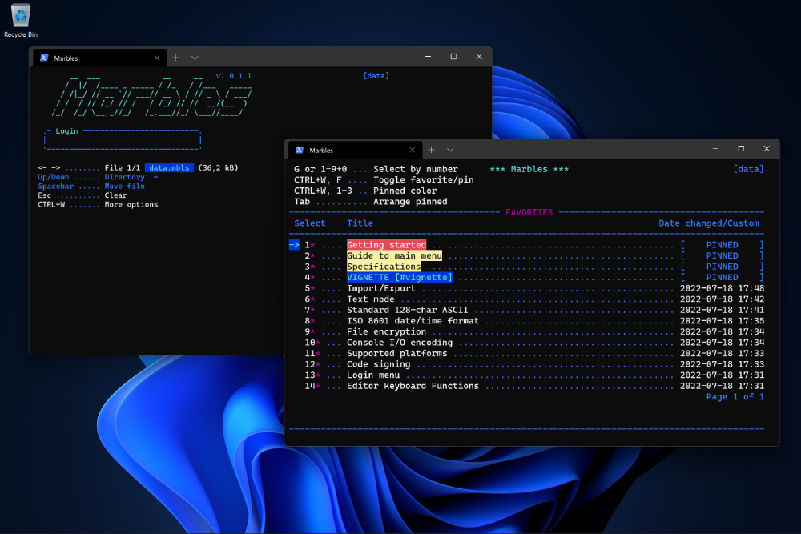
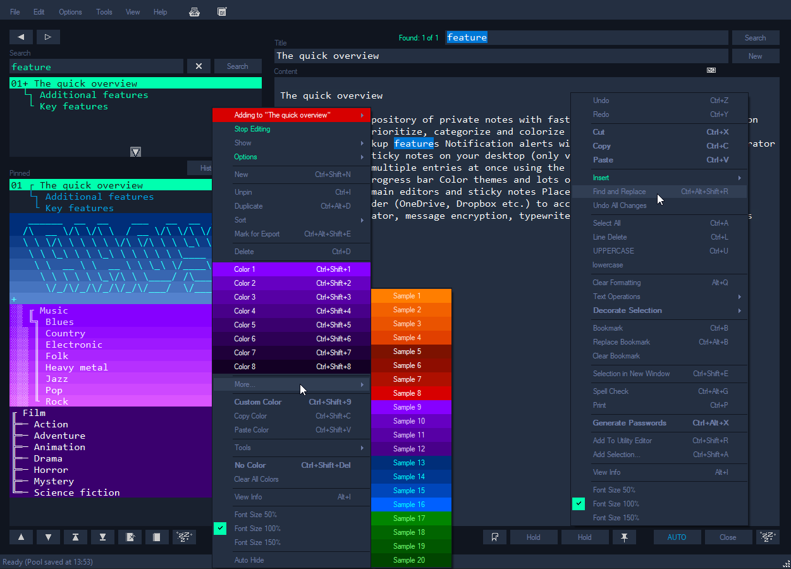

## NEWS! You might want to checkout my latest project:
[**Marbles** cross-platform note-taking software for Windows and Linux](https://github.com/artstisen/marbles)

- Marbles is made with the same principles in mind as AHOY: Notes are stored as a searchable collection of entries contained in a single encrypted file for easy portability.
- Plug Marbles into any Windows or Linux system and access your secure data in a 1-to-1 experience across platforms in your preferred terminal.
- The Marbles project contains the [_AhoyToMarbles_](https://github.com/artstisen/marbles/blob/main/Guide-to-installation.md) tool that can be used to migrate your AHOY data to Marbles.

# AHOY!
#### Note-taking software for Windows

## KEY FEATURES

- An unlimited repository of notes with fast live search, password protection and encryption
- Prioritize, categorize and colorize entries using the pinned list
- Autosave, backup and restore features
- Password generator
- Notification alerts
- Place up to 32 sticky notes on your desktopp
- Work on multiple entries at once using the detached PLOP Editor
- Checklist templates with progressbar
- Color themes and lots of customizations
- Multi monitor support for all main editors and sticky notes
- Calculator, message encryption, typewriter emulator, typing game and lots more...

## SPECIFICATIONS

- System requirements: Windows 11, 10, 8.1/8, 7 and Vista (32/64 bit) with .NET 4.8
- Installer: NSIS (Code signed/SHA2)
- Binaries: Single 3MB executable (Code signed/SHA2)
- License: AHOY! is distributed as free software under the MIT license
- Programming language: C#
- Technology: .NET (WinForms and WPF)
- File encryption: 3DES
- File output formats: .xml, .txt, .ahoy (Encrypted XML)
- Encoding: UTF-8
- DateTime format: ISO 8601
- Week numbers (notification dialog display): ISO 8601
- Default data directory: %appdata%\Ahoy
- Fonts: Consolas and Courier New

Please note: Windows 7 does not include the Consolas font by default, unless installed with Microsoft Office, Visual Studio etc. 
Please note: Dictionaries available to the AHOY! Spell Checker are dependent on the .NET Framework version currently installed on your system. Please consult the documentation for more information.
